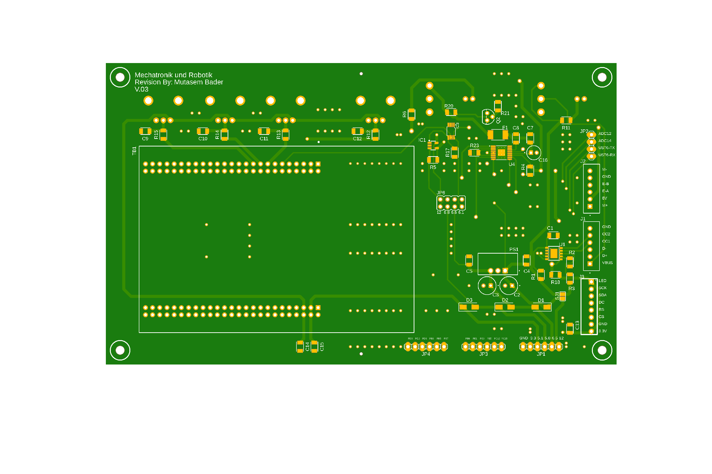
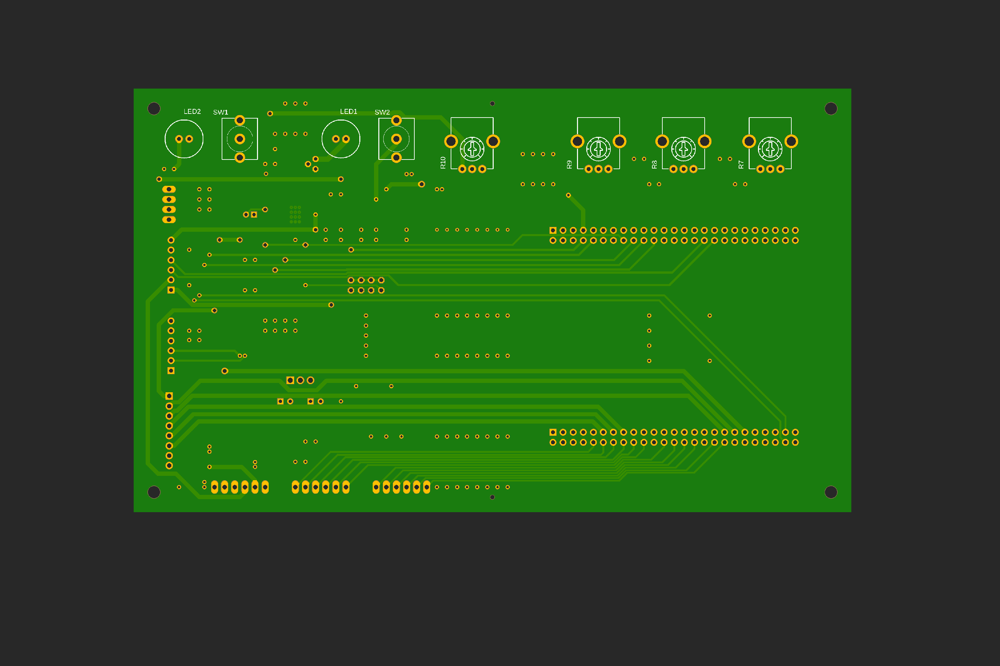

# PID Demonstrator (Only PCB)

> **Status: completed.** University project (SoSe 2025): PCB v1 built and tested, v2 designed (see Project Status).

**Custom PCB for a real-time PID control demonstrator based on the STM32F4 microcontroller.**

Developed as part of the Master's course *Simulation and Control* (Mechatronics & Robotics, Frankfurt UAS, SoSe 2025).

**Team project.** My part: hardware concept, schematic and two-layer PCB design, power supply (USB-C Power Delivery) and integration of the STM32F4. I supported the PID tuning with the MATLAB PID Tuner.

---

## Project Status

The **first PCB version** was fully assembled, tested, and successfully operated in the demonstrator setup. During testing, several hardware errors were identified on the board.

A **revised PCB version** was designed to fix these errors — however, this version was **never manufactured or tested**. The project was concluded at this point and is considered complete as a course deliverable.

---

## System Architecture

```
┌────────────────────────────────────────────────────┐
│                  PID Demonstrator                  │
│                                                    │
│  Setpoint ──► [PID Controller] ──► [DC Motor]      │
│  (Pot)        STM32F4-Discovery    + H-Bridge      │
│                     ▲                   │          │
│                     └─── [Sensor] ◄─────┘          │
│                          (Pot / Encoder)           │
│                                                    │
│  Display      ←  angle / speed / error             │
│  Serial port  ←  live data for plotting            │
└────────────────────────────────────────────────────┘
```

Third-party reference video (not my work): ["PID demo" by Voltix Electronics Lab on YouTube](https://youtu.be/qKy98Cbcltw)

---

## PCB Design

Design and layout of the custom PCB that integrates all hardware components on a single board.

### PCB Features

| Block | Components |
|---|---|
| Power management | USB-C Power Delivery sink (CH224K) for 12 V from a power bank, DC/DC module TSR 3-2465N for 6.5 V, diode drops for 5.8 V and 5.1 V; 3.3 V is supplied by the STM32F4-Discovery board |
| Motor current sensing | Shunt resistor + INA138 current monitor |
| Motor driver | DRV8848 dual H-bridge |
| Gain potentiometers | Three 10 kΩ rotary potentiometers for Kp, Ki, Kd |
| Setpoint potentiometer | One 10 kΩ rotary potentiometer |
| Display interface | SPI header for a 128×160 ST7735 TFT display |
| MCU interface | Pin header for STM32F4-Discovery board |
| Serial output | UART header for live data streaming |

### PCB Layout

The layout shown below is the **revised version (v2)**, which was designed but never manufactured. Its silkscreen reads "V.03" by mistake; it is not a third revision.

| Layer | Image |
|---|---|
| Top |  |
| Bottom |  |

### Schematic


### PCB Design File

See [`pcb-design.fbrd`](pcb-design.fbrd) (Fusion 360 Electronics board file; it contains EAGLE board data).

### Bill of Materials

[`bill-of-materials.xlsx`](bill-of-materials.xlsx) lists the parts with supplier part numbers and prices (Reichelt/Mouser, as of 03.06.2026) and refers to schematic v65. The reference designators follow that schematic and can differ from the revised board file (for example `PS1` for the DC/DC module instead of `U2`).

---

## References

- [DRV8848 datasheet](https://www.ti.com/lit/ds/symlink/drv8848.pdf) (Texas Instruments)
- [INA138 datasheet](https://www.ti.com/lit/ds/symlink/ina138.pdf) (Texas Instruments)

---

## License

Copyright (c) 2026 Mutasem Bader — All Rights Reserved.  
Viewing is permitted. Copying, modifying, or submitting as own work is strictly prohibited.  
See [LICENSE](LICENSE) for details.
